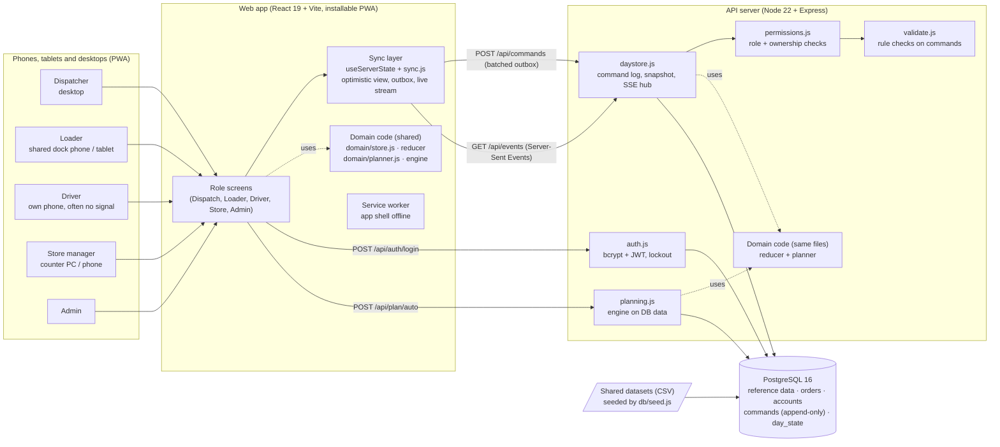
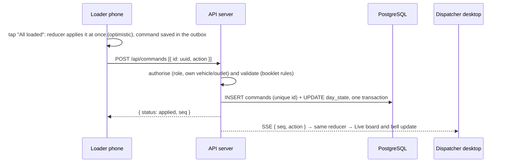

# Waypoint One · Architecture

Waypoint One is one web app for four roles (dispatcher, loader, driver, store manager, plus admin), backed by one API
server and one PostgreSQL database. The same domain code (the state reducer and the planning engine) runs in the
browser and on the server.

## Components

## How a change travels (one command)

- **Command log, not scattered updates.** Every change (publish, a loading tick, a hand-over, a store report, an
  incident decision) is a command with an id made on the device. The server records it in `commands`
  (append-only) and keeps the result in `day_state`. `POST /api/admin/rebuild` replays the log from the seed
  state and rebuilds the snapshot, so the log is the source of truth.
- **One set of rules.** `app/src/domain/store.js` (reducer) and `app/src/domain/planner.js` (planning engine) are
  plain JavaScript with no browser or React code. The browser uses them for instant, offline-capable updates;
  the server imports the same files, so the two never disagree about what a command means.
- **Server decides.** The server authorises each command (`permissions.js`: a driver can only act for their own
  vehicle, a store only for its own outlet, only a dispatcher can publish or move orders) and validates it
  (`validate.js`: a manual move is re-checked against every rule, publishing is refused while any rule is broken,
  deferring a shop skipped yesterday needs a written reason). A refused command is rolled back on the device
  with the reason.

## Offline and recovery (drivers on rural roads)

1. With no signal, the driver keeps working: the app shell is cached by the service worker, the day's data is in
   the last confirmed copy, and every action goes into the device's outbox (localStorage) and shows at once.
2. When the signal returns (the browser's `online` event, or the next retry), the outbox is sent in order.
3. Each command carries its device-made UUID; `commands.id` is UNIQUE. If a batch is sent twice (a timeout, a
   second tab, a retry), the second copy returns `duplicate` and changes nothing. That is the "0 duplicates"
   promise from the Dead Zone design.
4. Other portals see the records the moment they are applied (live stream). If a portal misses messages (gap in
   `seq`), it fetches the whole day again.

## Planning engine

`app/src/domain/planner.js`, run by the server on the seeded data (`POST /api/plan/auto`) or in the browser.

- **Hard rules (booklet p.20, the same as the organisers' `check_allocation.py`)**: one brand and one district per
  trip; own depot only; chilled orders only on reefers; van-only outlets only get vans; volume and weight within
  capacity; at most 2 trips per vehicle; Fresh trips share the 270-minute pre-dawn window and Style/Tech the
  480-minute day (booklet trip-time standard); orders are never split.
- **Our rules on top**: every stop reached inside its delivery (and mall) window, and the day's fuel within what is
  left of the weekly quota (fuel used so far this week is computed in SQL from the route-leg history).
- **Policy**: fairness first (shops deferred yesterday are served before anyone else), then the most chilled
  volume, then all volume, then fewer trips.
- **Search**: priority insertion with best-fit vehicle choice, an improvement pass that lets a deferred order
  replace smaller non-protected orders, and 300 seeded restarts; the best plan by the policy wins. Deterministic:
  the same inputs always give the same plan. About 1–2 s for the 85-order peak day.
- **Result on S1**: 76 of 85 served, all 10 shops skipped yesterday served, 49.6 m³ of chilled goods waiting (vs
  55.4 m³ in the team's published optimiser plan), passes `check_allocation.py`. Every allocation (engine output,
  published plan, manual edits) is checked by the same `check()` before it can be adopted or published.

## Deployment

- `docker compose up`: Postgres 16 + one app container (API + built web app on port 8080). On first start the
  container migrates the schema and seeds the database from `data/`.
- Hosted: the same image runs on any container host with a Postgres database (set `DATABASE_URL`, `JWT_SECRET`).
- The web app can also be hosted separately (e.g. Vercel) with `VITE_API_URL` pointing at the API. Built without
  `VITE_API_URL`, the app runs stand-alone in the browser (the Designathon prototype mode).

## Scaling notes (honest limits)

- Commands are applied one batch at a time in one process (a simple, correct total order). One depot's night is a
  few thousand commands, far below that limit. For several API instances, move the ordering into the database
  (row lock on `day_state`) and fan out the live stream with Postgres `LISTEN/NOTIFY`.
- The live stream is Server-Sent Events: one HTTP connection per open portal, reconnected automatically.
