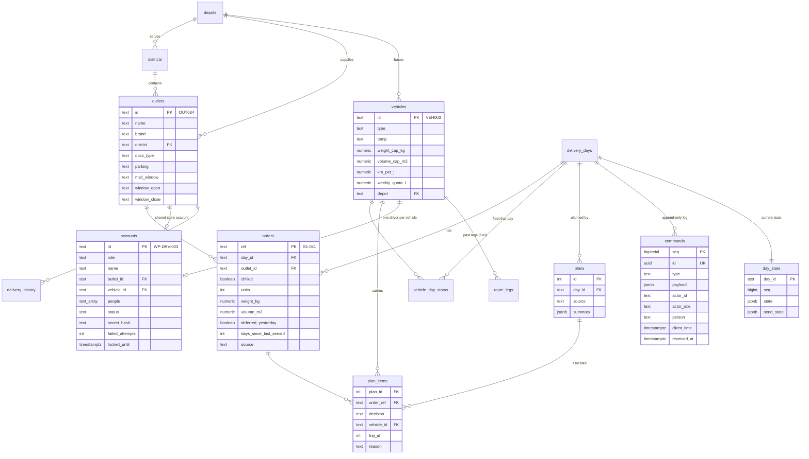

# Waypoint One · Data model

PostgreSQL schema: `server/db/migrations/001_schema.sql`. Three layers.

## 1. Reference data (seeded from the shared datasets)

| Table | Source file | Rows | Used for |
|---|---|---|---|
| `depots`, `districts` | `district_travel.csv` | 2, 12 | trip times and distances (booklet planning standard) |
| `outlets` | `outlets.csv` | 120 | windows, dock type, van-only access, mall windows; store names |
| `vehicles` | `vehicles.csv` | 60 | capacity, reefer or dry, van or truck, km/L, weekly fuel quota |
| `service_allowance` | `service_allowance.csv` | 9 | minutes per stop by brand and dock |
| `calendar` | `calendar.csv` | 910 | operating days, paydays, festivals, monsoon |
| `traffic_speed`, `road_conditions` | same names | 576, 10,920 | running-late predictions |
| `delivery_history` | `deliveries_train.csv` | 92,307 | days since a shop was last served |
| `route_legs` | `route_legs_train.csv` | 91,894 | fuel used so far this week (km on logged routes + return to depot, ÷ km/L) |

## 2. The delivery day

- `delivery_days`: the seeded day **S1**, the peak day Thu 8 Jan 2026 at Peliyagoda (`task2b_peak_day_*.csv`).
- `orders`: its 85 orders (`deferred_yesterday` and `days_since_last_served` drive the fairness guard).
  Replacement orders created on a bad day (e.g. `R-001` after Short at the Dock) are recorded in the day state.
- `vehicle_day_status`: which vehicles are in the workshop that day (10 of 38 at Peliyagoda, 5 of them reefers).
- `plans` / `plan_items`: every plan the engine produced, one row per order (served on vehicle + trip, or deferred
  with a reason).
- `accounts`: 185 accounts. Personal accounts for drivers (one per vehicle, enforced by a unique index) and
  dispatchers; one shared account per store and per depot (`people` lists who taps their name); one admin.
  Secrets are bcrypt hashes; 5 wrong tries lock the account for 15 minutes.

## 3. Operations

- `commands` is the append-only log of everything anyone did: type, full payload, who (account and the person on a
  shared account), when the device recorded it (`client_time`, can be hours before `received_at` after a dead
  zone), and a device-made UUID that makes replays harmless (`UNIQUE`).
- `day_state` holds the current shared state of the day (JSON), the `seq` of the last command applied and the seed
  state it started from. It is a projection: `POST /api/admin/rebuild` recomputes it from `commands`.

### What the day state contains

The shared state the reducer maintains (`app/src/domain/store.js`), in plain words:

| Field | Meaning |
|---|---|
| `clock` | the day and time every portal shows (demo control; a real deployment would follow the real clock) |
| `published`, `publishedBy` | tonight's plan is visible to loaders, drivers and stores |
| `planAlloc`, `planSource`, `planEdits`, `stopOrders` | the adopted plan (engine or team plan), manual moves with reasons, hand-set stop orders |
| `loadStarts`, `reeferChecked`, `loaded`, `loadedTrucks` | who started loading which truck and run, the reefer check, each tick, "all loaded" |
| `runStarted`, `stopProgress`, `delivered` | leaving the depot, arriving at a stop, the hand-over record (outcome, missing, reason, receiver, times, synced) |
| `driverReports`, `loaderReports`, `storeReports` | problems from the road, the dock and the shop, with the dispatcher's decisions |
| `adjusted`, `storeOrders` | orders sent short and their replacement orders; new store orders for the next run |
| `notifications`, `log`, `smsSent` | the dispatcher's bell, the shared activity log, messages sent to stores and drivers |
| `fleetEdits`, `storeEdits`, `accountStatus`, `peopleEdits` | workshop changes, store rules, account status, people on shared accounts |
